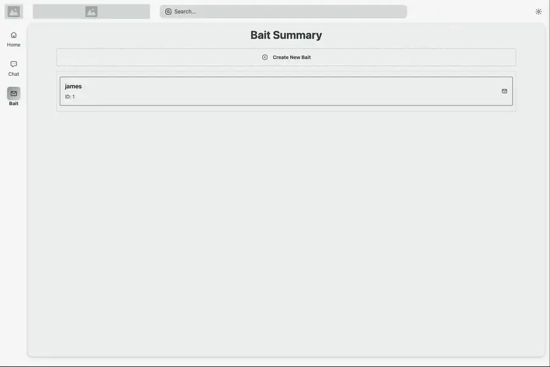
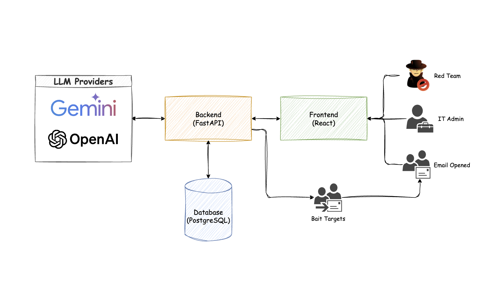

# Gap Analysis

A [hackathon](https://devpost.com/software/gap-analysis) demo for finding gaps in corporate anti-phishing processes.

<!-- add demo photo from docs/demo.webp -->
<p align="center">
  
</p>

## Table of Contents

- [Getting Started](#getting-started)
  - [Clone the Repository](#clone-the-repository)
  - [Open in VS Code](#open-in-vs-code)
- [Setup](#setup)
  - [Environment Variables](#environment-variables)
- [Important API Endpoints](#important-api-endpoints)
- [Architecture Overview](#architecture-overview)
- [Dev Container](#dev-container)
  - [Prerequisites](#prerequisites)
  - [Open the Dev Container](#open-the-dev-container)
  - [Running Services](#running-services)
  - [Setting up database](#setting-up-database)
- [Deployment to Docker Containers](#deployment-to-docker-containers)
  - [Building the API Docker Image](#building-the-api-docker-image)
  - [Building the UI Docker Image](#building-the-ui-docker-image)
  - [Deploying Docker Images](#deploying-docker-images)
    - [Example Deployment to Cloud](#example-deployment-to-cloud)

## Getting Started

### **Clone the Repository**: Clone this repository to your local machine

```sh
git clone https://github.com/FrancescoVassalli/GapAnalysis.git
cd GapAnalysis
```

### **Open in VS Code**: Open the repository in Visual Studio Code

```sh
code .
```

## Setup

You can manually run a Docker Compose environment or if you have Visual Studio Code with the Remote Containers extension you can use the [Dev Container](#dev-container) configuration.

1. Setup your `.env` - [see steps below](#environment-variables)
2. Have Docker Engine running on your system
3. In this directory `docker compose -f .devcontainer/docker-compose.yml up -d`
4. Go to `localhost:8000` to access the API

>[!NOTE]
>
> Your version of Docker Compose must be 2.0.0 or higher to use the `docker compose` command. Otherwise, you can use the `docker-compose` command.

### Environment Variables

Create a `.env` file in the root directory of the project and add the necessary environment variables:
>[!TIP]
>
>You can copy [`.env.example`](./.env.example) and rename it to `.env` and fill in the necessary values

```env
ALEMBIC_DATABASE_URL=postgresql://<user>:<passcode>@gap-postgres:5432/postgres
OPENAI_API_KEY=sk-<add-your-key>
ENV=development
GEMINI_API_KEY=AI<add-your-key>
```

## Important API Endpoints

FastAPI has a built-in Swagger UI that can be accessed at `localhost:8000/docs` or `localhost:8000/redoc`

## Architecture Overview

The project is structured as follows:

- **Backend**: [FastAPI](https://fastapi.tiangolo.com/)
  - Package Management: [Poetry](https://python-poetry.org/)
  - ORM: [Alembic](https://alembic.sqlalchemy.org/)
  - Formatting and Linting: [Black](https://black.readthedocs.io/en/stable/), [isort](https://pycqa.github.io/isort/)
  - Testing: [Pytest](https://docs.pytest.org/en/7.0.x/)
  - Schema Management: [OpenAPI](https://fastapi.tiangolo.com/reference/openapi/docs/)
- **Frontend**: [React](https://reactjs.org/)
  - Router: [TanStack Router](https://tanstack.com/router)
  - State Management: [TanStack Query](https://tanstack.com/query)
  - Styles: [Tailwind CSS](https://tailwindcss.com/)
  - Icons: [Scarlab](https://scarlab-icons.la-moore.ru/)
  - Formatting and Linting: [Biome](https://biomejs.dev/)
  - API Client: [OpenAPI Generator](https://heyapi.dev/)
- **Database**: [PostgreSQL](https://www.postgresql.org/)
- **LLM Providers**: [OpenAI](https://openai.com/api/) and [Google Gemini](https://aistudio.google.com/welcome)
- **Containerization**: [Docker](https://www.docker.com/)

<p align="center">
  
</p>

## Dev Container

The [`.devcontainer`](.devcontainer) folder contains a development container configuration for the GapAnalysis project. The devcontainer is configured to provide a consistent development environment using Docker and Visual Studio Code.

### Prerequisites

1. [**Docker**](https://www.docker.com/): Ensure Docker is installed and running on your system.
2. [**Visual Studio Code**](https://code.visualstudio.com/): Install Visual Studio Code.
3. [**Remote - Containers Extension**](https://marketplace.visualstudio.com/items?itemName=ms-vscode-remote.remote-containers): Install the Remote - Containers extension in Visual Studio Code.

### Open the Dev Container

- Press `F1` or `CMD/Ctrl` + `Shift` + `P` to open the command palette
  - Type and select `Remote-Containers: Reopen in Container`.

This will build and start the devcontainer defined in `.devcontainer/devcontainer.json`.

You can also click on the Remote Indicator in the **bottom-left status bar** to get a list of the most common commands. Remote Indicator status bar item: `><` to access this menu.

For more information, please see the [extension documentation](https://marketplace.visualstudio.com/items?itemName=ms-vscode-remote.remote-containers) or the [devcontainers documentation](https://code.visualstudio.com/docs/devcontainers/containers).

### Running Services

This repo contains pre-configured launch commands for the most common applications

In VS Code open the [Run and Debug](https://code.visualstudio.com/docs/editor/debugging) section or by pressing `F5`

Inside the Debug side bar you can Launch the services defined in [`.vscode/launch.json`](.vscode/launch.json)

- `Run Uvicorn`: Launches the FastAPI server

>Alternatively you can run `poetry run uvicorn main:app --host 0.0.0.0 --port 8000 --reload` in the integrated terminal

- `Run Website`: Generates the OpenAPI client from the FastAPI server and starts the React app

>Alternatively you can run `npm run generate-client` or `npm run dev` in the integrated terminal

### Setting up database

Run this command in the dev container to write the schema to the database

```bash
poetry run alembic upgrade head
```

### Deployment to Docker Containers

This project includes Docker configurations for both the API and the UI. The `build` folder contains the necessary production Dockerfiles.

#### Building the API Docker Image

To build the Docker image for the API, navigate to the `build/api` directory and run the following command:

```sh
docker build -f build/api.Dockerfile -t gap-analysis-api .
```

#### Building the UI Docker Image

Before building the Docker image for the UI, you need to build the static files using npm. Navigate to the root directory of the project and run:

```sh
npm run build
```

After the build process is complete, navigate to the `build/ui` directory and run the following command to build the Docker image:

```sh
docker build -f build/ui.Dockerfile -t gap-analysis-ui .
```

### Deploying Docker Images

Once the Docker images are built, you can deploy them to any cloud provider that supports Docker, such as Digital Ocean, GCP, AWS, and more.

#### Example Deployment to Cloud

1. Push the Docker images to a container registry (e.g., Docker Hub, Digital Ocean Container Registry, GitHub Container Registry, etc).
2. Run the Docker containers using the pulled images.

```sh
docker run -d --rm --name api -p 8000:8000 gap-analysis-api
docker run -d --rm --name ui -p 3000:3000 gap-analysis-ui
```

This will start the API on port `8000` and the UI on port `3000`.

For more detailed instructions on deploying to other cloud providers, refer to their respective documentation.
